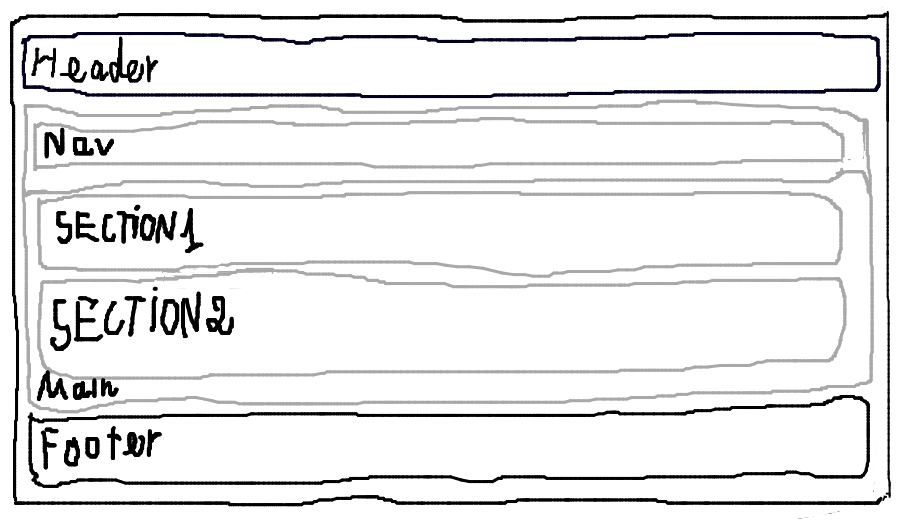

# 📚 Mini-Project Bài 1: Thiết Kế UI và Dựng Bố Cục Website Học Tập

Dự án nhỏ này nằm trong chuỗi bài tập thực hành thiết kế giao diện (UI Sketch) trên Canvas, xuất ảnh thành phẩm và chuyển đổi cấu trúc đó thành một trang web hoàn chỉnh bằng cách sử dụng các thẻ tuần tự (Semantic Tags) trong **HTML5**.

---

## 🗺️ Giao Diện Phác Thảo (UI Sketch)

Dưới đây là bản phác thảo giao diện sơ bộ được vẽ trên Canvas trước khi tiến hành code:


*(Lưu ý: Đảm bảo tên file ảnh trong repo của bạn trùng khớp với tên `ui-sketch.png` để ảnh hiển thị tại đây)*

---

## 📂 Cấu Trúc Thư Mục Gốc (Repository Structure)

Repo được tổ chức gọn gàng theo đúng yêu cầu đề xuất:

```text
├── index.html       # File mã nguồn HTML chứa cấu trúc trang web học tập
├── ui-sketch.png    # Ảnh phác thảo giao diện xuất từ canvas
└── README.md        # Tài liệu hướng dẫn và giới thiệu dự án (File này)
